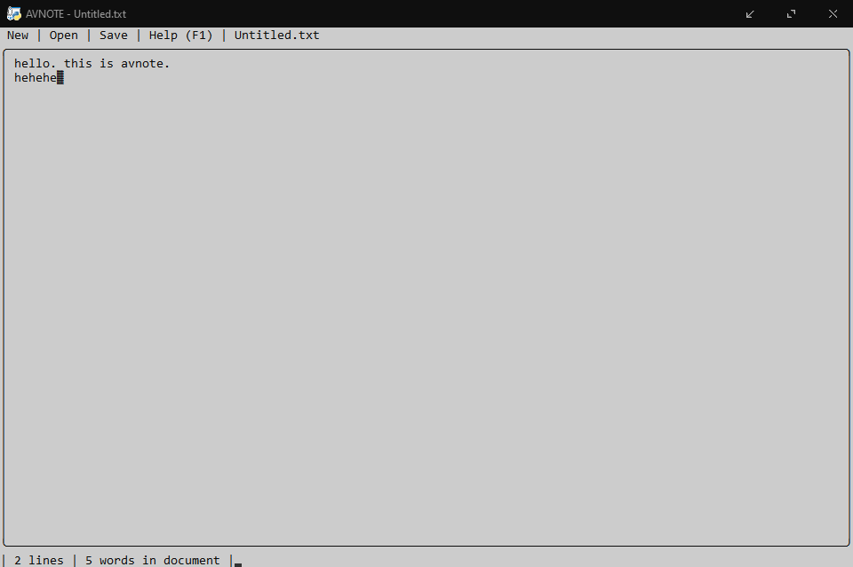

# avnote
### GUI-Less Notepad? What?

### Requirements
 - colorama
 - sys
 - time
 - msvcrt
 - threading
 - os
 - *IMPORTANT* Colors enabled in console through registry (download and run  )
### Features
 - Can be resized!
 - SUpports Opening, saving and creating new document.
 - Supports multiline documents (Obviously, enter, backspace and space work as you'd expect.)
### Known Bugs
 - Scrolling hasn't been implemented yet, so long content may cause visual glitches. but is in the works.
 - minor glitches here and there
 - if you dont press enter when you reach the end of line, the line simply gets bigger (and looks ugly). Being fixed
 - if you try to select/click with your mouse, everything disappears. right click brings it back though. For the time being, use only your keyboard.
